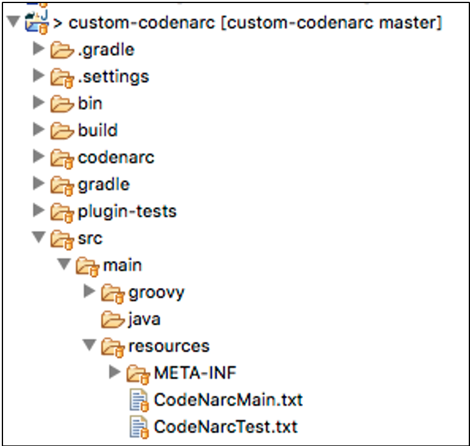
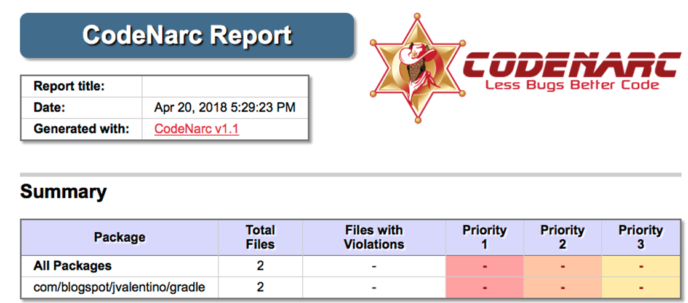

# 5 Practical Examples

​      The following are a series of practical examples, that cover the needs that most larger system efforts will encounter. The needs range from enabling code consistency across multiple projects, to automating delivery when third-party options are not available. Gradle is just another means for automating command-line interactions, with the advantage of already being a part of the build environment. This advantage makes it ideal for making reusable build actions, and filling build, test, and deployment gaps.

## 5.1 Common CodeNarc

CodeNarc has been used through the examples, to enforce standard Groovy coding convention and catch common bugs. Using this however has requires that the same Groovy ruleset, as with the application of that ruleset in the build.gradle, be copy and pasted numerous times. A common need to ensure the same standards cross multiple projects, and to make it so boilerplate code does not need to be copied and pasted. 

The purpose of this plugin is to demonstrate how a CodeNarc ruleset can be made a part of a Gradle plugin, including how that ruleset is applied. This makes it to the rules can be applied by applying a single plugin, instead of applying the CodeNarc plugin, and then having to define the extensions for appropriately using it.

#### build.gradle

```groovy
// PLUGINS
apply plugin: 'groovy'
apply plugin: 'codenarc'
apply plugin: 'jacoco'
apply plugin: 'maven'

// CODENARC
codenarc {
	toolVersion = "1.1"
}

codenarcMain {
	configFile = file("codenarc/CodeNarcMain.groovy")
	reports {
		html.enabled = true
		xml.enabled = true
	}
}

codenarcTest {
	configFile = file("codenarc/CodeNarcTest.groovy")
}

```

The code we are replacing is in the build.gradle for the plugin itself. This is the application of the “codenarc” plugin with the **codenarc**, **codenarcMain**, and **codenarcTest** extensions. Note that it is possible once this plugin is finished, to increment the version and replace this code within the previous version of the plugin. However, I have found this to be confusing, having a plugin use an olrder version of itself.

```groovy
dependencies {
    compile gradleApi()
    compile 'org.codehaus.groovy:groovy-all:2.4.12'
    compile 'commons-io:commons-io:2.4'
    
    testCompile 'org.spockframework:spock-core:1.1-groovy-2.4'
    testCompile 'cglib:cglib:3.2.6'
    testCompile 'org.objenesis:objenesis:2.6'
}

```


#### src/main/groovy/com/blogspot/jvalenitno/gradle/CustomCodeNarcPlugin.groovy

```groovy
class CustomCodeNarcPlugin implements Plugin<Project> {

    File mainFile = getTempFileFromClasspath('/CodeNarcMain.txt')
    File testFile = getTempFileFromClasspath('/CodeNarcTest.txt')

    void apply(Project project) {
        project.configure(project) {
            apply plugin:'codenarc'

            afterEvaluate {
                codenarc { toolVersion = '1.1' }

                codenarcMain {
                    configFile = mainFile
                    reports {
                        html.enabled = true
                        xml.enabled = true
                    }
                }

                codenarcTest { configFile = testFile }

                project.task('echoCodenarc') {
                    println "- Codenarc Main: ${mainFile.absolutePath}"
                    println "- Codenarc Test: ${testFile.absolutePath}"
                }
                project.tasks.codenarcMain.finalizedBy 'echoCodenarc'
            }
        }
    }

```

**Lines 14-15: The rulesets**

The rulesets are two Groovy files, which must be a part of the plugin Jar, which means:

·   Resources within the jar must be accessed via a classpath

·   Even when putting files under the src/main/resources directory, anything with a .groovy extension will be compiled into a .class file. For this reason, the .text extension is used to prevent this accidental compilation.

 

**Line 18: project.configure**

The **project.configure** closure represents the root of the applying build.gradle. Any code placed in this closure is the same if it were placed in the build.gralde directly.

 

**Line 21: afterEvaluate**

Your build script can receive notifications as the build progresses through its lifecycle. These notifications generally take two forms: You can either implement a particular listener interface, or you can provide a closure to execute when the notification is fired.

\-    https://docs.gradle.org/current/userguide/build_lifecycle.html

 

This closure is a callback for after the build has been evaluated, specifically so that all build related variables have been populated for other plugins. If an extension were to be used, that extension’s values would not be populated until this point in the build lifecycle.

 

**Lines 22-32: The extensions**

The extensions required for enabling codenarc with a specific ruleset are used but pointing to the main and test files from the classpath location instead of relative to the root of the project.

 

**Lines 34-38: Echo settings**

A task is added to echo the locations of the main and test ruleset files, which always runs after the **codenarcMain** task.

```groovy
    InputStream getResourceAsStream(String classpath) {
        this.getClass().getResourceAsStream(classpath)
    }

    File getTempFileFromClasspath(String classpath) {
        File file = File.createTempFile('codenarc', '.groovy')
        FileOutputStream out = new FileOutputStream(file)
        InputStream input = this.getResourceAsStream(classpath)
        IOUtils.copy(input, out)
        file.deleteOnExit()
        file
    }

```

**Lines 43-53: Getting a classpath resource as an InputStream**

This method is used to lookup a resource on the classpath, and return it as an InputStream.

 

**Lines 47-54: Creating a temporary file from the classpath**

Codenarc requires the main and test files as actual files to work. To accomplish this, a temporary file is created on the file system, that gets deleted with the build exits.



#### plugin-tests/local/build.gradle

```groovy
buildscript {
  repositories {
	jcenter()
  }
  dependencies {
    classpath 'com.blogspot.jvalentino.gradle:custom-codenarc:1.0.0'
  }
}

apply plugin: 'custom-codenarc'
apply plugin: 'groovy'

// GROOVY
version = '1.0.0'
group = 'com.blogspot.jvalentino.gradle'
archivesBaseName = 'hello-world-codenarc'

repositories {
    jcenter()
    mavenCentral()
}

dependencies {
    compile gradleApi()
    compile 'org.codehaus.groovy:groovy-all:2.4.12'

    testCompile 'org.spockframework:spock-core:1.1-groovy-2.4'
}

```

 

To test the workings of the plugin, the applying project must be a Groovy based application. The original “Hello World” plugin is used, as it contains a small amount of Groovy code that was validated against the Codenarc rules sets as a part of its own build.gradle. The build.gradle has had the Codenarc extensions removed, replaced by the application of the custom-codenarc plugin.

#### Manual Testing

```bash
plugin-tests/local$ gradlew check

> Configure project : 
- Codenarc Main: /var/folders/j4/m6z5bjd15_zd9c0cr_smcqfh0000gn/T/codenarc1784061774541663453.groovy
- Codenarc Test: /var/folders/j4/m6z5bjd15_zd9c0cr_smcqfh0000gn/T/codenarc367979144052337343.groovy

BUILD SUCCESSFUL

```

When the **check** task is run in the test build, the output shows the two temporary ruleset files that were used.

 

#### plugin-tests/local/build/reports/codenarc/main.html



The build/reports directory now contains the report in both HTML and XML format. The HTML report is intended for human consumption, while the XML report can be read by existing build plugins on a continuous integration server.


